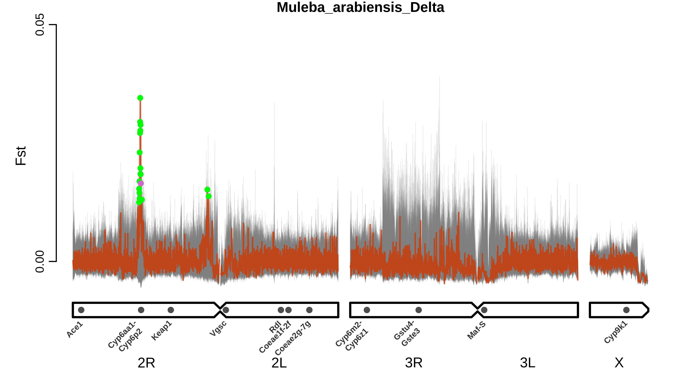
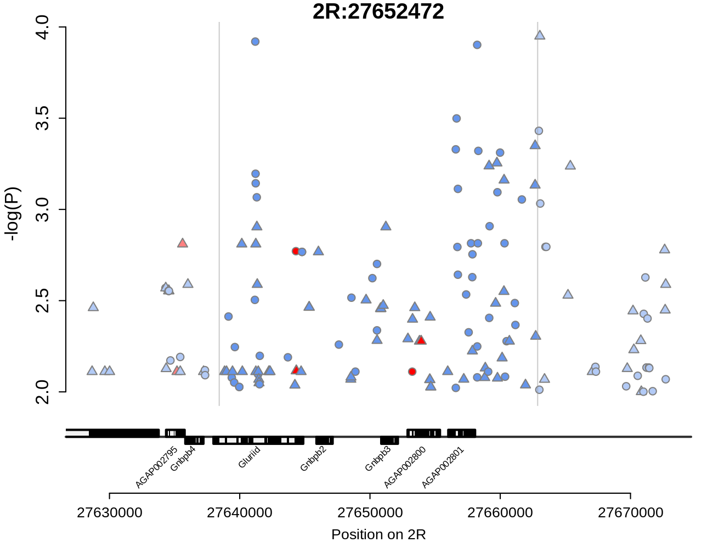
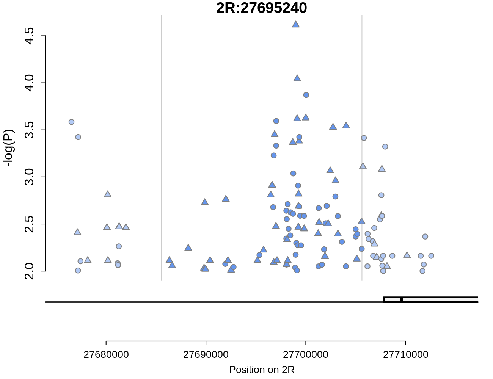
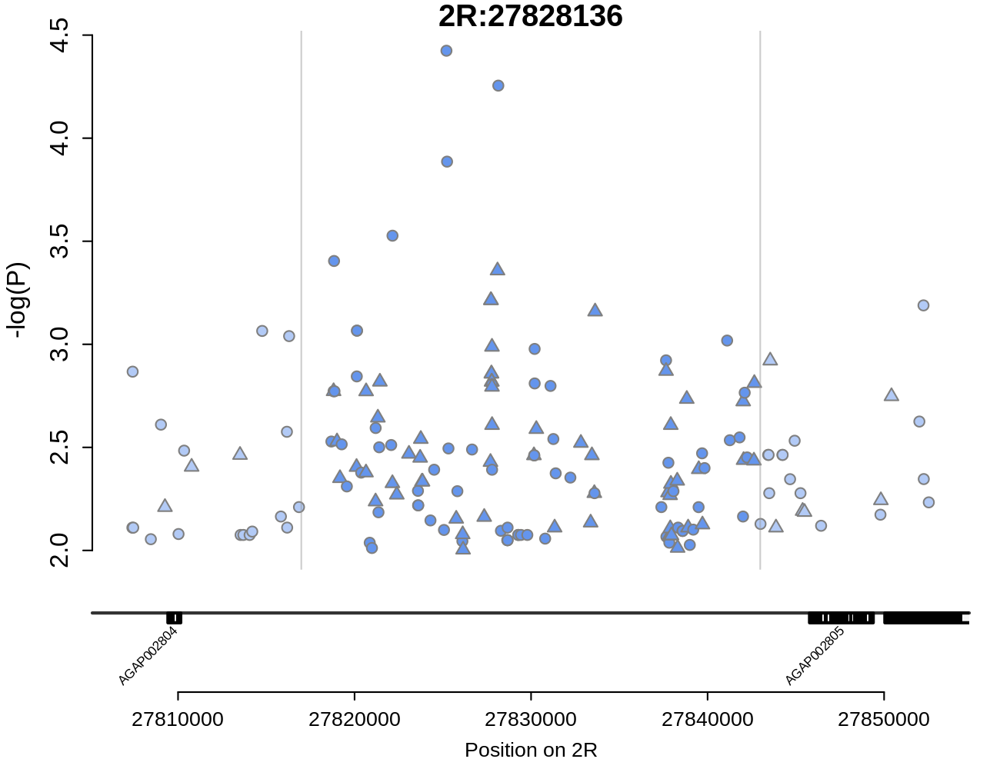
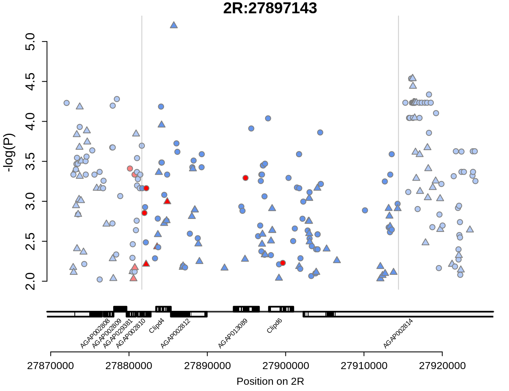
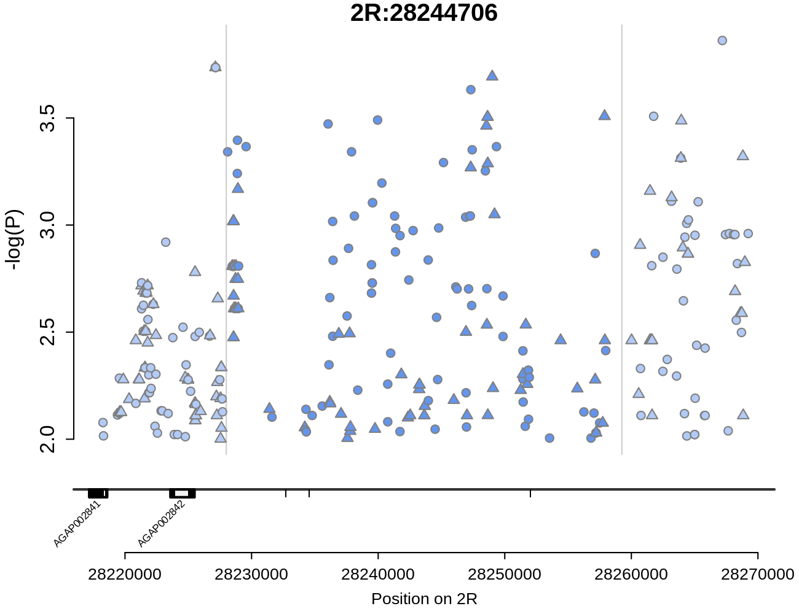
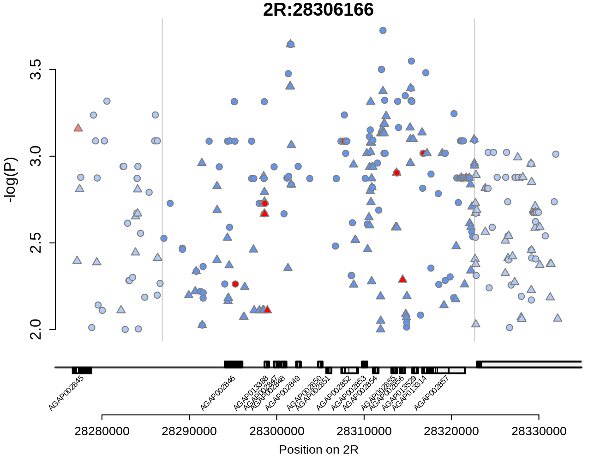
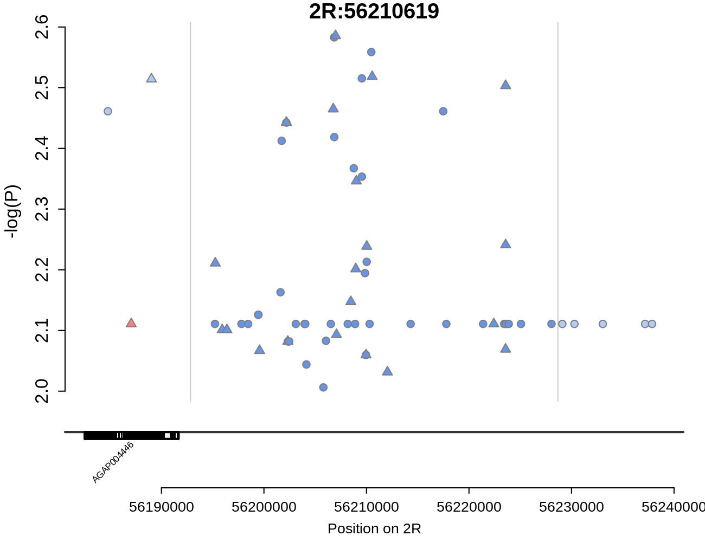

# FST windows of interest

For each sample set, we first provide a summary plot of FST bewteen resistant and susceptible samples across the genome, with FST shown in red and the results of the 200 randomisations shown behind in grey. Windows identified as peaks are highlighted by points, colour-coded by whether they are significantly higher than expected based on the simulations (green) or not (purple). For each significant window (green points), we then provide four additional figures. The first shows the significant (*P* < 0.01) SNPs found in the region of that window, and their -log10(Pvalue) of association with phenotype. Red points indicate non-synonymous SNPs, blue points indicate all other SNPs. Point shape indicates whether the mutant allele at that SNP is associated with increased (circle) or decreased (triangle) resistance. Dark points in the centre of the plot show SNPs within the significant window, light points on the sides show SNPs in region 10,000 bp either side of the window. The second plot shows the hierarchical cluster of haplotypes in the window, with brackets indicating large haplotype clusters. The third plot shows, each haplotype cluster, indicating the number of haplotypes comprising the cluster (n), the *P* value of association of the cluster with resistance phenotype, and the SNPs that differentiate that cluster from other haplotypes in the region, colour-coded by type (red = non-synonymous, yellow = synonymous, blue = non-coding). The final figure shows the contingency tables of phenotype association for each haplotype cluster. 

[Legend](#Plot_legend)  
[Moshi\_*arabiensis*\_Delta](#moshi_arabiensis_delta)  
[Muleba\_*arabiensis*\_Delta](#muleba_arabiensis_delta)  
[Moshi\_*arabiensis*\_PM](#moshi_arabiensis_pm)  

___

## Plot legend

<a id="Plot_legend">

___

## Moshi\_*arabiensis*\_Delta

&nbsp;

[Moshi_arabiensis_Delta_2R:30957775-30988675](#moshi_arabiensis_delta_2r_30957775-30988675)  

### Moshi_arabiensis_Delta_2R_30957775-30988675

&nbsp;

&nbsp;

&nbsp;

&nbsp;

#### Contingency table for cluster_1:

| &nbsp;&nbsp;&nbsp;  phenotype  &nbsp;&nbsp;&nbsp; |  &nbsp;&nbsp;&nbsp;  wt  &nbsp;&nbsp;&nbsp;  |  &nbsp;&nbsp;&nbsp;  het  &nbsp;&nbsp;&nbsp;  |  &nbsp;&nbsp;&nbsp;  hom  &nbsp;&nbsp;&nbsp;  |
| :---:     | :---: | :---: | :---: |
|  alive    | 51 | 27 | 2 |
|  dead     | 39 | 11 | 1 |

&nbsp;

#### Contingency table for cluster_2:

| &nbsp;&nbsp;&nbsp;  phenotype  &nbsp;&nbsp;&nbsp; |  &nbsp;&nbsp;&nbsp;  wt  &nbsp;&nbsp;&nbsp;  |  &nbsp;&nbsp;&nbsp;  het  &nbsp;&nbsp;&nbsp;  |  &nbsp;&nbsp;&nbsp;  hom  &nbsp;&nbsp;&nbsp;  |
| :---:     | :---: | :---: | :---: |
|  alive    | 70 | 10 | 0 |
|  dead     | 34 | 13 | 4 |

&nbsp;

___

## Muleba\_*arabiensis*\_Delta

&nbsp;

[Muleba_arabiensis_Delta_2R:27638426-27662872](#muleba_arabiensis_delta_2r_27638426-27662872)  
[Muleba_arabiensis_Delta_2R:27685539-27705619](#muleba_arabiensis_delta_2r_27685539-27705619)  
[Muleba_arabiensis_Delta_2R:27816983-27842983](#muleba_arabiensis_delta_2r_27816983-27842983)  
[Muleba_arabiensis_Delta_2R:27842983-27881640](#muleba_arabiensis_delta_2r_27842983-27881640)  
[Muleba_arabiensis_Delta_2R:27881639-27914408](#muleba_arabiensis_delta_2r_27881639-27914408)  
[Muleba_arabiensis_Delta_2R:27914407-27940942](#muleba_arabiensis_delta_2r_27914407-27940942)  
[Muleba_arabiensis_Delta_2R:28053952-28093398](#muleba_arabiensis_delta_2r_28053952-28093398)  
[Muleba_arabiensis_Delta_2R:28093397-28143756](#muleba_arabiensis_delta_2r_28093397-28143756)  
[Muleba_arabiensis_Delta_2R:28143756-28184032](#muleba_arabiensis_delta_2r_28143756-28184032)  
[Muleba_arabiensis_Delta_2R:28184031-28228003](#muleba_arabiensis_delta_2r_28184031-28228003)  
[Muleba_arabiensis_Delta_2R:28228002-28259252](#muleba_arabiensis_delta_2r_28228002-28259252)  
[Muleba_arabiensis_Delta_2R:28259251-28286905](#muleba_arabiensis_delta_2r_28259251-28286905)  
[Muleba_arabiensis_Delta_2R:28286905-28322651](#muleba_arabiensis_delta_2r_28286905-28322651)  
[Muleba_arabiensis_Delta_2R:28322651-28359439](#muleba_arabiensis_delta_2r_28322651-28359439)  
[Muleba_arabiensis_Delta_2R:28861167-28883982](#muleba_arabiensis_delta_2r_28861167-28883982)  
[Muleba_arabiensis_Delta_2R:56192837-56228671](#muleba_arabiensis_delta_2r_56192837-56228671)  
[Muleba_arabiensis_Delta_2R:56720537-56789287](#muleba_arabiensis_delta_2r_56720537-56789287)  

### Muleba_arabiensis_Delta_2R_27638426-27662872

&nbsp;

&nbsp;

&nbsp;

&nbsp;

#### Contingency table for cluster_1:

| &nbsp;&nbsp;&nbsp;  phenotype  &nbsp;&nbsp;&nbsp; |  &nbsp;&nbsp;&nbsp;  wt  &nbsp;&nbsp;&nbsp;  |  &nbsp;&nbsp;&nbsp;  het  &nbsp;&nbsp;&nbsp;  |  &nbsp;&nbsp;&nbsp;  hom  &nbsp;&nbsp;&nbsp;  |
| :---:     | :---: | :---: | :---: |
|  alive    | 28 | 41 | 12 |
|  dead     | 49 | 25 | 7 |

&nbsp;

#### Contingency table for cluster_2:

| &nbsp;&nbsp;&nbsp;  phenotype  &nbsp;&nbsp;&nbsp; |  &nbsp;&nbsp;&nbsp;  wt  &nbsp;&nbsp;&nbsp;  |  &nbsp;&nbsp;&nbsp;  het  &nbsp;&nbsp;&nbsp;  |  &nbsp;&nbsp;&nbsp;  hom  &nbsp;&nbsp;&nbsp;  |
| :---:     | :---: | :---: | :---: |
|  alive    | 60 | 20 | 1 |
|  dead     | 52 | 26 | 3 |

&nbsp;

### Muleba_arabiensis_Delta_2R_27685539-27705619

&nbsp;

&nbsp;

&nbsp;

&nbsp;

#### Contingency table for cluster_1:

| &nbsp;&nbsp;&nbsp;  phenotype  &nbsp;&nbsp;&nbsp; |  &nbsp;&nbsp;&nbsp;  wt  &nbsp;&nbsp;&nbsp;  |  &nbsp;&nbsp;&nbsp;  het  &nbsp;&nbsp;&nbsp;  |  &nbsp;&nbsp;&nbsp;  hom  &nbsp;&nbsp;&nbsp;  |
| :---:     | :---: | :---: | :---: |
|  alive    | 31 | 38 | 12 |
|  dead     | 48 | 27 | 6 |

&nbsp;

#### Contingency table for cluster_2:

| &nbsp;&nbsp;&nbsp;  phenotype  &nbsp;&nbsp;&nbsp; |  &nbsp;&nbsp;&nbsp;  wt  &nbsp;&nbsp;&nbsp;  |  &nbsp;&nbsp;&nbsp;  het  &nbsp;&nbsp;&nbsp;  |  &nbsp;&nbsp;&nbsp;  hom  &nbsp;&nbsp;&nbsp;  |
| :---:     | :---: | :---: | :---: |
|  alive    | 62 | 17 | 2 |
|  dead     | 50 | 28 | 3 |

&nbsp;

### Muleba_arabiensis_Delta_2R_27816983-27842983

&nbsp;

&nbsp;

&nbsp;

&nbsp;

#### Contingency table for cluster_1:

| &nbsp;&nbsp;&nbsp;  phenotype  &nbsp;&nbsp;&nbsp; |  &nbsp;&nbsp;&nbsp;  wt  &nbsp;&nbsp;&nbsp;  |  &nbsp;&nbsp;&nbsp;  het  &nbsp;&nbsp;&nbsp;  |  &nbsp;&nbsp;&nbsp;  hom  &nbsp;&nbsp;&nbsp;  |
| :---:     | :---: | :---: | :---: |
|  alive    | 28 | 38 | 15 |
|  dead     | 44 | 30 | 7 |

&nbsp;

#### Contingency table for cluster_2:

| &nbsp;&nbsp;&nbsp;  phenotype  &nbsp;&nbsp;&nbsp; |  &nbsp;&nbsp;&nbsp;  wt  &nbsp;&nbsp;&nbsp;  |  &nbsp;&nbsp;&nbsp;  het  &nbsp;&nbsp;&nbsp;  |  &nbsp;&nbsp;&nbsp;  hom  &nbsp;&nbsp;&nbsp;  |
| :---:     | :---: | :---: | :---: |
|  alive    | 58 | 22 | 1 |
|  dead     | 48 | 28 | 5 |

&nbsp;

#### Contingency table for cluster_3:

| &nbsp;&nbsp;&nbsp;  phenotype  &nbsp;&nbsp;&nbsp; |  &nbsp;&nbsp;&nbsp;  wt  &nbsp;&nbsp;&nbsp;  |  &nbsp;&nbsp;&nbsp;  het  &nbsp;&nbsp;&nbsp;  |  &nbsp;&nbsp;&nbsp;  hom  &nbsp;&nbsp;&nbsp;  |
| :---:     | :---: | :---: | :---: |
|  alive    | 72 | 9 | 0 |
|  dead     | 67 | 14 | 0 |

&nbsp;

### Muleba_arabiensis_Delta_2R_27842983-27881640

&nbsp;

&nbsp;

&nbsp;

&nbsp;

#### Contingency table for cluster_1:

| &nbsp;&nbsp;&nbsp;  phenotype  &nbsp;&nbsp;&nbsp; |  &nbsp;&nbsp;&nbsp;  wt  &nbsp;&nbsp;&nbsp;  |  &nbsp;&nbsp;&nbsp;  het  &nbsp;&nbsp;&nbsp;  |  &nbsp;&nbsp;&nbsp;  hom  &nbsp;&nbsp;&nbsp;  |
| :---:     | :---: | :---: | :---: |
|  alive    | 28 | 37 | 16 |
|  dead     | 45 | 30 | 6 |

&nbsp;

#### Contingency table for cluster_2:

| &nbsp;&nbsp;&nbsp;  phenotype  &nbsp;&nbsp;&nbsp; |  &nbsp;&nbsp;&nbsp;  wt  &nbsp;&nbsp;&nbsp;  |  &nbsp;&nbsp;&nbsp;  het  &nbsp;&nbsp;&nbsp;  |  &nbsp;&nbsp;&nbsp;  hom  &nbsp;&nbsp;&nbsp;  |
| :---:     | :---: | :---: | :---: |
|  alive    | 58 | 21 | 2 |
|  dead     | 48 | 28 | 5 |

&nbsp;

### Muleba_arabiensis_Delta_2R_27881639-27914408

&nbsp;

&nbsp;

&nbsp;

&nbsp;

#### Contingency table for cluster_1:

| &nbsp;&nbsp;&nbsp;  phenotype  &nbsp;&nbsp;&nbsp; |  &nbsp;&nbsp;&nbsp;  wt  &nbsp;&nbsp;&nbsp;  |  &nbsp;&nbsp;&nbsp;  het  &nbsp;&nbsp;&nbsp;  |  &nbsp;&nbsp;&nbsp;  hom  &nbsp;&nbsp;&nbsp;  |
| :---:     | :---: | :---: | :---: |
|  alive    | 53 | 28 | 0 |
|  dead     | 60 | 21 | 0 |

&nbsp;

#### Contingency table for cluster_2:

| &nbsp;&nbsp;&nbsp;  phenotype  &nbsp;&nbsp;&nbsp; |  &nbsp;&nbsp;&nbsp;  wt  &nbsp;&nbsp;&nbsp;  |  &nbsp;&nbsp;&nbsp;  het  &nbsp;&nbsp;&nbsp;  |  &nbsp;&nbsp;&nbsp;  hom  &nbsp;&nbsp;&nbsp;  |
| :---:     | :---: | :---: | :---: |
|  alive    | 46 | 35 | 0 |
|  dead     | 71 | 10 | 0 |

&nbsp;

#### Contingency table for cluster_3:

| &nbsp;&nbsp;&nbsp;  phenotype  &nbsp;&nbsp;&nbsp; |  &nbsp;&nbsp;&nbsp;  wt  &nbsp;&nbsp;&nbsp;  |  &nbsp;&nbsp;&nbsp;  het  &nbsp;&nbsp;&nbsp;  |  &nbsp;&nbsp;&nbsp;  hom  &nbsp;&nbsp;&nbsp;  |
| :---:     | :---: | :---: | :---: |
|  alive    | 68 | 13 | 0 |
|  dead     | 61 | 20 | 0 |

&nbsp;

#### Contingency table for cluster_4:

| &nbsp;&nbsp;&nbsp;  phenotype  &nbsp;&nbsp;&nbsp; |  &nbsp;&nbsp;&nbsp;  wt  &nbsp;&nbsp;&nbsp;  |  &nbsp;&nbsp;&nbsp;  het  &nbsp;&nbsp;&nbsp;  |  &nbsp;&nbsp;&nbsp;  hom  &nbsp;&nbsp;&nbsp;  |
| :---:     | :---: | :---: | :---: |
|  alive    | 73 | 8 | 0 |
|  dead     | 67 | 14 | 0 |

&nbsp;

### Muleba_arabiensis_Delta_2R_27914407-27940942

&nbsp;

&nbsp;

&nbsp;

&nbsp;

#### Contingency table for cluster_1:

| &nbsp;&nbsp;&nbsp;  phenotype  &nbsp;&nbsp;&nbsp; |  &nbsp;&nbsp;&nbsp;  wt  &nbsp;&nbsp;&nbsp;  |  &nbsp;&nbsp;&nbsp;  het  &nbsp;&nbsp;&nbsp;  |  &nbsp;&nbsp;&nbsp;  hom  &nbsp;&nbsp;&nbsp;  |
| :---:     | :---: | :---: | :---: |
|  alive    | 26 | 38 | 17 |
|  dead     | 44 | 31 | 6 |

&nbsp;

#### Contingency table for cluster_2:

| &nbsp;&nbsp;&nbsp;  phenotype  &nbsp;&nbsp;&nbsp; |  &nbsp;&nbsp;&nbsp;  wt  &nbsp;&nbsp;&nbsp;  |  &nbsp;&nbsp;&nbsp;  het  &nbsp;&nbsp;&nbsp;  |  &nbsp;&nbsp;&nbsp;  hom  &nbsp;&nbsp;&nbsp;  |
| :---:     | :---: | :---: | :---: |
|  alive    | 59 | 20 | 2 |
|  dead     | 47 | 29 | 5 |

&nbsp;

### Muleba_arabiensis_Delta_2R_28053952-28093398

&nbsp;

&nbsp;

&nbsp;

&nbsp;

#### Contingency table for cluster_1:

| &nbsp;&nbsp;&nbsp;  phenotype  &nbsp;&nbsp;&nbsp; |  &nbsp;&nbsp;&nbsp;  wt  &nbsp;&nbsp;&nbsp;  |  &nbsp;&nbsp;&nbsp;  het  &nbsp;&nbsp;&nbsp;  |  &nbsp;&nbsp;&nbsp;  hom  &nbsp;&nbsp;&nbsp;  |
| :---:     | :---: | :---: | :---: |
|  alive    | 22 | 41 | 18 |
|  dead     | 42 | 31 | 8 |

&nbsp;

#### Contingency table for cluster_2:

| &nbsp;&nbsp;&nbsp;  phenotype  &nbsp;&nbsp;&nbsp; |  &nbsp;&nbsp;&nbsp;  wt  &nbsp;&nbsp;&nbsp;  |  &nbsp;&nbsp;&nbsp;  het  &nbsp;&nbsp;&nbsp;  |  &nbsp;&nbsp;&nbsp;  hom  &nbsp;&nbsp;&nbsp;  |
| :---:     | :---: | :---: | :---: |
|  alive    | 57 | 21 | 3 |
|  dead     | 39 | 34 | 8 |

&nbsp;

#### Contingency table for cluster_3:

| &nbsp;&nbsp;&nbsp;  phenotype  &nbsp;&nbsp;&nbsp; |  &nbsp;&nbsp;&nbsp;  wt  &nbsp;&nbsp;&nbsp;  |  &nbsp;&nbsp;&nbsp;  het  &nbsp;&nbsp;&nbsp;  |  &nbsp;&nbsp;&nbsp;  hom  &nbsp;&nbsp;&nbsp;  |
| :---:     | :---: | :---: | :---: |
|  alive    | 69 | 11 | 1 |
|  dead     | 70 | 11 | 0 |

&nbsp;

#### Contingency table for cluster_4:

| &nbsp;&nbsp;&nbsp;  phenotype  &nbsp;&nbsp;&nbsp; |  &nbsp;&nbsp;&nbsp;  wt  &nbsp;&nbsp;&nbsp;  |  &nbsp;&nbsp;&nbsp;  het  &nbsp;&nbsp;&nbsp;  |  &nbsp;&nbsp;&nbsp;  hom  &nbsp;&nbsp;&nbsp;  |
| :---:     | :---: | :---: | :---: |
|  alive    | 72 | 9 | 0 |
|  dead     | 66 | 15 | 0 |

&nbsp;

### Muleba_arabiensis_Delta_2R_28093397-28143756

&nbsp;

&nbsp;

&nbsp;

&nbsp;

#### Contingency table for cluster_1:

| &nbsp;&nbsp;&nbsp;  phenotype  &nbsp;&nbsp;&nbsp; |  &nbsp;&nbsp;&nbsp;  wt  &nbsp;&nbsp;&nbsp;  |  &nbsp;&nbsp;&nbsp;  het  &nbsp;&nbsp;&nbsp;  |  &nbsp;&nbsp;&nbsp;  hom  &nbsp;&nbsp;&nbsp;  |
| :---:     | :---: | :---: | :---: |
|  alive    | 22 | 39 | 20 |
|  dead     | 41 | 32 | 8 |

&nbsp;

#### Contingency table for cluster_2:

| &nbsp;&nbsp;&nbsp;  phenotype  &nbsp;&nbsp;&nbsp; |  &nbsp;&nbsp;&nbsp;  wt  &nbsp;&nbsp;&nbsp;  |  &nbsp;&nbsp;&nbsp;  het  &nbsp;&nbsp;&nbsp;  |  &nbsp;&nbsp;&nbsp;  hom  &nbsp;&nbsp;&nbsp;  |
| :---:     | :---: | :---: | :---: |
|  alive    | 57 | 20 | 4 |
|  dead     | 40 | 34 | 7 |

&nbsp;

#### Contingency table for cluster_3:

| &nbsp;&nbsp;&nbsp;  phenotype  &nbsp;&nbsp;&nbsp; |  &nbsp;&nbsp;&nbsp;  wt  &nbsp;&nbsp;&nbsp;  |  &nbsp;&nbsp;&nbsp;  het  &nbsp;&nbsp;&nbsp;  |  &nbsp;&nbsp;&nbsp;  hom  &nbsp;&nbsp;&nbsp;  |
| :---:     | :---: | :---: | :---: |
|  alive    | 72 | 9 | 0 |
|  dead     | 65 | 16 | 0 |

&nbsp;

#### Contingency table for cluster_4:

| &nbsp;&nbsp;&nbsp;  phenotype  &nbsp;&nbsp;&nbsp; |  &nbsp;&nbsp;&nbsp;  wt  &nbsp;&nbsp;&nbsp;  |  &nbsp;&nbsp;&nbsp;  het  &nbsp;&nbsp;&nbsp;  |  &nbsp;&nbsp;&nbsp;  hom  &nbsp;&nbsp;&nbsp;  |
| :---:     | :---: | :---: | :---: |
|  alive    | 71 | 10 | 0 |
|  dead     | 70 | 11 | 0 |

&nbsp;

### Muleba_arabiensis_Delta_2R_28143756-28184032

&nbsp;

&nbsp;

&nbsp;

&nbsp;

#### Contingency table for cluster_1:

| &nbsp;&nbsp;&nbsp;  phenotype  &nbsp;&nbsp;&nbsp; |  &nbsp;&nbsp;&nbsp;  wt  &nbsp;&nbsp;&nbsp;  |  &nbsp;&nbsp;&nbsp;  het  &nbsp;&nbsp;&nbsp;  |  &nbsp;&nbsp;&nbsp;  hom  &nbsp;&nbsp;&nbsp;  |
| :---:     | :---: | :---: | :---: |
|  alive    | 19 | 39 | 23 |
|  dead     | 38 | 35 | 8 |

&nbsp;

#### Contingency table for cluster_2:

| &nbsp;&nbsp;&nbsp;  phenotype  &nbsp;&nbsp;&nbsp; |  &nbsp;&nbsp;&nbsp;  wt  &nbsp;&nbsp;&nbsp;  |  &nbsp;&nbsp;&nbsp;  het  &nbsp;&nbsp;&nbsp;  |  &nbsp;&nbsp;&nbsp;  hom  &nbsp;&nbsp;&nbsp;  |
| :---:     | :---: | :---: | :---: |
|  alive    | 57 | 20 | 4 |
|  dead     | 42 | 32 | 7 |

&nbsp;

#### Contingency table for cluster_3:

| &nbsp;&nbsp;&nbsp;  phenotype  &nbsp;&nbsp;&nbsp; |  &nbsp;&nbsp;&nbsp;  wt  &nbsp;&nbsp;&nbsp;  |  &nbsp;&nbsp;&nbsp;  het  &nbsp;&nbsp;&nbsp;  |  &nbsp;&nbsp;&nbsp;  hom  &nbsp;&nbsp;&nbsp;  |
| :---:     | :---: | :---: | :---: |
|  alive    | 71 | 10 | 0 |
|  dead     | 64 | 16 | 1 |

&nbsp;

### Muleba_arabiensis_Delta_2R_28184031-28228003

&nbsp;

&nbsp;

&nbsp;

&nbsp;

#### Contingency table for cluster_1:

| &nbsp;&nbsp;&nbsp;  phenotype  &nbsp;&nbsp;&nbsp; |  &nbsp;&nbsp;&nbsp;  wt  &nbsp;&nbsp;&nbsp;  |  &nbsp;&nbsp;&nbsp;  het  &nbsp;&nbsp;&nbsp;  |  &nbsp;&nbsp;&nbsp;  hom  &nbsp;&nbsp;&nbsp;  |
| :---:     | :---: | :---: | :---: |
|  alive    | 18 | 39 | 24 |
|  dead     | 36 | 37 | 8 |

&nbsp;

#### Contingency table for cluster_2:

| &nbsp;&nbsp;&nbsp;  phenotype  &nbsp;&nbsp;&nbsp; |  &nbsp;&nbsp;&nbsp;  wt  &nbsp;&nbsp;&nbsp;  |  &nbsp;&nbsp;&nbsp;  het  &nbsp;&nbsp;&nbsp;  |  &nbsp;&nbsp;&nbsp;  hom  &nbsp;&nbsp;&nbsp;  |
| :---:     | :---: | :---: | :---: |
|  alive    | 55 | 21 | 5 |
|  dead     | 41 | 32 | 8 |

&nbsp;

#### Contingency table for cluster_3:

| &nbsp;&nbsp;&nbsp;  phenotype  &nbsp;&nbsp;&nbsp; |  &nbsp;&nbsp;&nbsp;  wt  &nbsp;&nbsp;&nbsp;  |  &nbsp;&nbsp;&nbsp;  het  &nbsp;&nbsp;&nbsp;  |  &nbsp;&nbsp;&nbsp;  hom  &nbsp;&nbsp;&nbsp;  |
| :---:     | :---: | :---: | :---: |
|  alive    | 71 | 10 | 0 |
|  dead     | 64 | 17 | 0 |

&nbsp;

#### Contingency table for cluster_4:

| &nbsp;&nbsp;&nbsp;  phenotype  &nbsp;&nbsp;&nbsp; |  &nbsp;&nbsp;&nbsp;  wt  &nbsp;&nbsp;&nbsp;  |  &nbsp;&nbsp;&nbsp;  het  &nbsp;&nbsp;&nbsp;  |  &nbsp;&nbsp;&nbsp;  hom  &nbsp;&nbsp;&nbsp;  |
| :---:     | :---: | :---: | :---: |
|  alive    | 70 | 11 | 0 |
|  dead     | 68 | 13 | 0 |

&nbsp;

### Muleba_arabiensis_Delta_2R_28228002-28259252

&nbsp;

&nbsp;

&nbsp;

&nbsp;

#### Contingency table for cluster_1:

| &nbsp;&nbsp;&nbsp;  phenotype  &nbsp;&nbsp;&nbsp; |  &nbsp;&nbsp;&nbsp;  wt  &nbsp;&nbsp;&nbsp;  |  &nbsp;&nbsp;&nbsp;  het  &nbsp;&nbsp;&nbsp;  |  &nbsp;&nbsp;&nbsp;  hom  &nbsp;&nbsp;&nbsp;  |
| :---:     | :---: | :---: | :---: |
|  alive    | 15 | 42 | 24 |
|  dead     | 33 | 39 | 9 |

&nbsp;

#### Contingency table for cluster_2:

| &nbsp;&nbsp;&nbsp;  phenotype  &nbsp;&nbsp;&nbsp; |  &nbsp;&nbsp;&nbsp;  wt  &nbsp;&nbsp;&nbsp;  |  &nbsp;&nbsp;&nbsp;  het  &nbsp;&nbsp;&nbsp;  |  &nbsp;&nbsp;&nbsp;  hom  &nbsp;&nbsp;&nbsp;  |
| :---:     | :---: | :---: | :---: |
|  alive    | 56 | 20 | 5 |
|  dead     | 44 | 29 | 8 |

&nbsp;

#### Contingency table for cluster_3:

| &nbsp;&nbsp;&nbsp;  phenotype  &nbsp;&nbsp;&nbsp; |  &nbsp;&nbsp;&nbsp;  wt  &nbsp;&nbsp;&nbsp;  |  &nbsp;&nbsp;&nbsp;  het  &nbsp;&nbsp;&nbsp;  |  &nbsp;&nbsp;&nbsp;  hom  &nbsp;&nbsp;&nbsp;  |
| :---:     | :---: | :---: | :---: |
|  alive    | 72 | 9 | 0 |
|  dead     | 66 | 15 | 0 |

&nbsp;

### Muleba_arabiensis_Delta_2R_28259251-28286905

&nbsp;

&nbsp;

&nbsp;

&nbsp;

#### Contingency table for cluster_1:

| &nbsp;&nbsp;&nbsp;  phenotype  &nbsp;&nbsp;&nbsp; |  &nbsp;&nbsp;&nbsp;  wt  &nbsp;&nbsp;&nbsp;  |  &nbsp;&nbsp;&nbsp;  het  &nbsp;&nbsp;&nbsp;  |  &nbsp;&nbsp;&nbsp;  hom  &nbsp;&nbsp;&nbsp;  |
| :---:     | :---: | :---: | :---: |
|  alive    | 15 | 42 | 24 |
|  dead     | 30 | 40 | 11 |

&nbsp;

#### Contingency table for cluster_2:

| &nbsp;&nbsp;&nbsp;  phenotype  &nbsp;&nbsp;&nbsp; |  &nbsp;&nbsp;&nbsp;  wt  &nbsp;&nbsp;&nbsp;  |  &nbsp;&nbsp;&nbsp;  het  &nbsp;&nbsp;&nbsp;  |  &nbsp;&nbsp;&nbsp;  hom  &nbsp;&nbsp;&nbsp;  |
| :---:     | :---: | :---: | :---: |
|  alive    | 54 | 22 | 5 |
|  dead     | 42 | 31 | 8 |

&nbsp;

#### Contingency table for cluster_3:

| &nbsp;&nbsp;&nbsp;  phenotype  &nbsp;&nbsp;&nbsp; |  &nbsp;&nbsp;&nbsp;  wt  &nbsp;&nbsp;&nbsp;  |  &nbsp;&nbsp;&nbsp;  het  &nbsp;&nbsp;&nbsp;  |  &nbsp;&nbsp;&nbsp;  hom  &nbsp;&nbsp;&nbsp;  |
| :---:     | :---: | :---: | :---: |
|  alive    | 72 | 9 | 0 |
|  dead     | 67 | 14 | 0 |

&nbsp;

### Muleba_arabiensis_Delta_2R_28286905-28322651

&nbsp;

&nbsp;

&nbsp;

&nbsp;

#### Contingency table for cluster_1:

| &nbsp;&nbsp;&nbsp;  phenotype  &nbsp;&nbsp;&nbsp; |  &nbsp;&nbsp;&nbsp;  wt  &nbsp;&nbsp;&nbsp;  |  &nbsp;&nbsp;&nbsp;  het  &nbsp;&nbsp;&nbsp;  |  &nbsp;&nbsp;&nbsp;  hom  &nbsp;&nbsp;&nbsp;  |
| :---:     | :---: | :---: | :---: |
|  alive    | 12 | 44 | 25 |
|  dead     | 27 | 42 | 12 |

&nbsp;

#### Contingency table for cluster_2:

| &nbsp;&nbsp;&nbsp;  phenotype  &nbsp;&nbsp;&nbsp; |  &nbsp;&nbsp;&nbsp;  wt  &nbsp;&nbsp;&nbsp;  |  &nbsp;&nbsp;&nbsp;  het  &nbsp;&nbsp;&nbsp;  |  &nbsp;&nbsp;&nbsp;  hom  &nbsp;&nbsp;&nbsp;  |
| :---:     | :---: | :---: | :---: |
|  alive    | 52 | 24 | 5 |
|  dead     | 40 | 33 | 8 |

&nbsp;

#### Contingency table for cluster_3:

| &nbsp;&nbsp;&nbsp;  phenotype  &nbsp;&nbsp;&nbsp; |  &nbsp;&nbsp;&nbsp;  wt  &nbsp;&nbsp;&nbsp;  |  &nbsp;&nbsp;&nbsp;  het  &nbsp;&nbsp;&nbsp;  |  &nbsp;&nbsp;&nbsp;  hom  &nbsp;&nbsp;&nbsp;  |
| :---:     | :---: | :---: | :---: |
|  alive    | 73 | 8 | 0 |
|  dead     | 67 | 14 | 0 |

&nbsp;

### Muleba_arabiensis_Delta_2R_28322651-28359439

&nbsp;

&nbsp;

&nbsp;

&nbsp;

#### Contingency table for cluster_1:

| &nbsp;&nbsp;&nbsp;  phenotype  &nbsp;&nbsp;&nbsp; |  &nbsp;&nbsp;&nbsp;  wt  &nbsp;&nbsp;&nbsp;  |  &nbsp;&nbsp;&nbsp;  het  &nbsp;&nbsp;&nbsp;  |  &nbsp;&nbsp;&nbsp;  hom  &nbsp;&nbsp;&nbsp;  |
| :---:     | :---: | :---: | :---: |
|  alive    | 12 | 45 | 24 |
|  dead     | 27 | 41 | 13 |

&nbsp;

#### Contingency table for cluster_2:

| &nbsp;&nbsp;&nbsp;  phenotype  &nbsp;&nbsp;&nbsp; |  &nbsp;&nbsp;&nbsp;  wt  &nbsp;&nbsp;&nbsp;  |  &nbsp;&nbsp;&nbsp;  het  &nbsp;&nbsp;&nbsp;  |  &nbsp;&nbsp;&nbsp;  hom  &nbsp;&nbsp;&nbsp;  |
| :---:     | :---: | :---: | :---: |
|  alive    | 52 | 24 | 5 |
|  dead     | 42 | 32 | 7 |

&nbsp;

#### Contingency table for cluster_3:

| &nbsp;&nbsp;&nbsp;  phenotype  &nbsp;&nbsp;&nbsp; |  &nbsp;&nbsp;&nbsp;  wt  &nbsp;&nbsp;&nbsp;  |  &nbsp;&nbsp;&nbsp;  het  &nbsp;&nbsp;&nbsp;  |  &nbsp;&nbsp;&nbsp;  hom  &nbsp;&nbsp;&nbsp;  |
| :---:     | :---: | :---: | :---: |
|  alive    | 72 | 9 | 0 |
|  dead     | 68 | 13 | 0 |

&nbsp;

### Muleba_arabiensis_Delta_2R_28861167-28883982

&nbsp;

&nbsp;

&nbsp;

&nbsp;

#### Contingency table for cluster_1:

| &nbsp;&nbsp;&nbsp;  phenotype  &nbsp;&nbsp;&nbsp; |  &nbsp;&nbsp;&nbsp;  wt  &nbsp;&nbsp;&nbsp;  |  &nbsp;&nbsp;&nbsp;  het  &nbsp;&nbsp;&nbsp;  |  &nbsp;&nbsp;&nbsp;  hom  &nbsp;&nbsp;&nbsp;  |
| :---:     | :---: | :---: | :---: |
|  alive    | 35 | 42 | 4 |
|  dead     | 33 | 38 | 10 |

&nbsp;

#### Contingency table for cluster_2:

| &nbsp;&nbsp;&nbsp;  phenotype  &nbsp;&nbsp;&nbsp; |  &nbsp;&nbsp;&nbsp;  wt  &nbsp;&nbsp;&nbsp;  |  &nbsp;&nbsp;&nbsp;  het  &nbsp;&nbsp;&nbsp;  |  &nbsp;&nbsp;&nbsp;  hom  &nbsp;&nbsp;&nbsp;  |
| :---:     | :---: | :---: | :---: |
|  alive    | 45 | 32 | 4 |
|  dead     | 40 | 35 | 6 |

&nbsp;

### Muleba_arabiensis_Delta_2R_56192837-56228671

&nbsp;

&nbsp;

&nbsp;

&nbsp;

#### Contingency table for cluster_1:

| &nbsp;&nbsp;&nbsp;  phenotype  &nbsp;&nbsp;&nbsp; |  &nbsp;&nbsp;&nbsp;  wt  &nbsp;&nbsp;&nbsp;  |  &nbsp;&nbsp;&nbsp;  het  &nbsp;&nbsp;&nbsp;  |  &nbsp;&nbsp;&nbsp;  hom  &nbsp;&nbsp;&nbsp;  |
| :---:     | :---: | :---: | :---: |
|  alive    | 42 | 36 | 3 |
|  dead     | 56 | 21 | 4 |

&nbsp;

#### Contingency table for cluster_2:

| &nbsp;&nbsp;&nbsp;  phenotype  &nbsp;&nbsp;&nbsp; |  &nbsp;&nbsp;&nbsp;  wt  &nbsp;&nbsp;&nbsp;  |  &nbsp;&nbsp;&nbsp;  het  &nbsp;&nbsp;&nbsp;  |  &nbsp;&nbsp;&nbsp;  hom  &nbsp;&nbsp;&nbsp;  |
| :---:     | :---: | :---: | :---: |
|  alive    | 67 | 11 | 3 |
|  dead     | 62 | 17 | 2 |

&nbsp;

#### Contingency table for cluster_3:

| &nbsp;&nbsp;&nbsp;  phenotype  &nbsp;&nbsp;&nbsp; |  &nbsp;&nbsp;&nbsp;  wt  &nbsp;&nbsp;&nbsp;  |  &nbsp;&nbsp;&nbsp;  het  &nbsp;&nbsp;&nbsp;  |  &nbsp;&nbsp;&nbsp;  hom  &nbsp;&nbsp;&nbsp;  |
| :---:     | :---: | :---: | :---: |
|  alive    | 69 | 12 | 0 |
|  dead     | 61 | 19 | 1 |

&nbsp;

#### Contingency table for cluster_4:

| &nbsp;&nbsp;&nbsp;  phenotype  &nbsp;&nbsp;&nbsp; |  &nbsp;&nbsp;&nbsp;  wt  &nbsp;&nbsp;&nbsp;  |  &nbsp;&nbsp;&nbsp;  het  &nbsp;&nbsp;&nbsp;  |  &nbsp;&nbsp;&nbsp;  hom  &nbsp;&nbsp;&nbsp;  |
| :---:     | :---: | :---: | :---: |
|  alive    | 71 | 9 | 1 |
|  dead     | 61 | 20 | 0 |

&nbsp;

#### Contingency table for cluster_5:

| &nbsp;&nbsp;&nbsp;  phenotype  &nbsp;&nbsp;&nbsp; |  &nbsp;&nbsp;&nbsp;  wt  &nbsp;&nbsp;&nbsp;  |  &nbsp;&nbsp;&nbsp;  het  &nbsp;&nbsp;&nbsp;  |  &nbsp;&nbsp;&nbsp;  hom  &nbsp;&nbsp;&nbsp;  |
| :---:     | :---: | :---: | :---: |
|  alive    | 72 | 8 | 1 |
|  dead     | 71 | 8 | 2 |

&nbsp;

#### Contingency table for cluster_6:

| &nbsp;&nbsp;&nbsp;  phenotype  &nbsp;&nbsp;&nbsp; |  &nbsp;&nbsp;&nbsp;  wt  &nbsp;&nbsp;&nbsp;  |  &nbsp;&nbsp;&nbsp;  het  &nbsp;&nbsp;&nbsp;  |  &nbsp;&nbsp;&nbsp;  hom  &nbsp;&nbsp;&nbsp;  |
| :---:     | :---: | :---: | :---: |
|  alive    | 66 | 15 | 0 |
|  dead     | 75 | 6 | 0 |

&nbsp;

### Muleba_arabiensis_Delta_2R_56720537-56789287

&nbsp;

&nbsp;

&nbsp;

&nbsp;

#### Contingency table for cluster_1:

| &nbsp;&nbsp;&nbsp;  phenotype  &nbsp;&nbsp;&nbsp; |  &nbsp;&nbsp;&nbsp;  wt  &nbsp;&nbsp;&nbsp;  |  &nbsp;&nbsp;&nbsp;  het  &nbsp;&nbsp;&nbsp;  |  &nbsp;&nbsp;&nbsp;  hom  &nbsp;&nbsp;&nbsp;  |
| :---:     | :---: | :---: | :---: |
|  alive    | 67 | 11 | 3 |
|  dead     | 62 | 16 | 3 |

&nbsp;

#### Contingency table for cluster_2:

| &nbsp;&nbsp;&nbsp;  phenotype  &nbsp;&nbsp;&nbsp; |  &nbsp;&nbsp;&nbsp;  wt  &nbsp;&nbsp;&nbsp;  |  &nbsp;&nbsp;&nbsp;  het  &nbsp;&nbsp;&nbsp;  |  &nbsp;&nbsp;&nbsp;  hom  &nbsp;&nbsp;&nbsp;  |
| :---:     | :---: | :---: | :---: |
|  alive    | 70 | 11 | 0 |
|  dead     | 59 | 20 | 2 |

&nbsp;

#### Contingency table for cluster_3:

| &nbsp;&nbsp;&nbsp;  phenotype  &nbsp;&nbsp;&nbsp; |  &nbsp;&nbsp;&nbsp;  wt  &nbsp;&nbsp;&nbsp;  |  &nbsp;&nbsp;&nbsp;  het  &nbsp;&nbsp;&nbsp;  |  &nbsp;&nbsp;&nbsp;  hom  &nbsp;&nbsp;&nbsp;  |
| :---:     | :---: | :---: | :---: |
|  alive    | 71 | 9 | 1 |
|  dead     | 60 | 21 | 0 |

&nbsp;

#### Contingency table for cluster_4:

| &nbsp;&nbsp;&nbsp;  phenotype  &nbsp;&nbsp;&nbsp; |  &nbsp;&nbsp;&nbsp;  wt  &nbsp;&nbsp;&nbsp;  |  &nbsp;&nbsp;&nbsp;  het  &nbsp;&nbsp;&nbsp;  |  &nbsp;&nbsp;&nbsp;  hom  &nbsp;&nbsp;&nbsp;  |
| :---:     | :---: | :---: | :---: |
|  alive    | 58 | 22 | 1 |
|  dead     | 73 | 8 | 0 |

&nbsp;

#### Contingency table for cluster_5:

| &nbsp;&nbsp;&nbsp;  phenotype  &nbsp;&nbsp;&nbsp; |  &nbsp;&nbsp;&nbsp;  wt  &nbsp;&nbsp;&nbsp;  |  &nbsp;&nbsp;&nbsp;  het  &nbsp;&nbsp;&nbsp;  |  &nbsp;&nbsp;&nbsp;  hom  &nbsp;&nbsp;&nbsp;  |
| :---:     | :---: | :---: | :---: |
|  alive    | 61 | 20 | 0 |
|  dead     | 70 | 10 | 1 |

&nbsp;

#### Contingency table for cluster_6:

| &nbsp;&nbsp;&nbsp;  phenotype  &nbsp;&nbsp;&nbsp; |  &nbsp;&nbsp;&nbsp;  wt  &nbsp;&nbsp;&nbsp;  |  &nbsp;&nbsp;&nbsp;  het  &nbsp;&nbsp;&nbsp;  |  &nbsp;&nbsp;&nbsp;  hom  &nbsp;&nbsp;&nbsp;  |
| :---:     | :---: | :---: | :---: |
|  alive    | 69 | 11 | 1 |
|  dead     | 72 | 6 | 3 |

&nbsp;

#### Contingency table for cluster_7:

| &nbsp;&nbsp;&nbsp;  phenotype  &nbsp;&nbsp;&nbsp; |  &nbsp;&nbsp;&nbsp;  wt  &nbsp;&nbsp;&nbsp;  |  &nbsp;&nbsp;&nbsp;  het  &nbsp;&nbsp;&nbsp;  |  &nbsp;&nbsp;&nbsp;  hom  &nbsp;&nbsp;&nbsp;  |
| :---:     | :---: | :---: | :---: |
|  alive    | 69 | 12 | 0 |
|  dead     | 72 | 9 | 0 |

&nbsp;

___

## Moshi\_*arabiensis*\_PM

&nbsp;

[Moshi_arabiensis_PM_3R:46657236-46697631](#moshi_arabiensis_pm_3r_46657236-46697631)  

### Moshi_arabiensis_PM_3R_46657236-46697631

&nbsp;

&nbsp;

&nbsp;

&nbsp;

#### Contingency table for cluster_1:

| &nbsp;&nbsp;&nbsp;  phenotype  &nbsp;&nbsp;&nbsp; |  &nbsp;&nbsp;&nbsp;  wt  &nbsp;&nbsp;&nbsp;  |  &nbsp;&nbsp;&nbsp;  het  &nbsp;&nbsp;&nbsp;  |  &nbsp;&nbsp;&nbsp;  hom  &nbsp;&nbsp;&nbsp;  |
| :---:     | :---: | :---: | :---: |
|  alive    | 52 | 26 | 4 |
|  dead     | 54 | 15 | 0 |

&nbsp;

#### Contingency table for cluster_2:

| &nbsp;&nbsp;&nbsp;  phenotype  &nbsp;&nbsp;&nbsp; |  &nbsp;&nbsp;&nbsp;  wt  &nbsp;&nbsp;&nbsp;  |  &nbsp;&nbsp;&nbsp;  het  &nbsp;&nbsp;&nbsp;  |  &nbsp;&nbsp;&nbsp;  hom  &nbsp;&nbsp;&nbsp;  |
| :---:     | :---: | :---: | :---: |
|  alive    | 69 | 12 | 1 |
|  dead     | 57 | 12 | 0 |

&nbsp;

#### Contingency table for cluster_3:

| &nbsp;&nbsp;&nbsp;  phenotype  &nbsp;&nbsp;&nbsp; |  &nbsp;&nbsp;&nbsp;  wt  &nbsp;&nbsp;&nbsp;  |  &nbsp;&nbsp;&nbsp;  het  &nbsp;&nbsp;&nbsp;  |  &nbsp;&nbsp;&nbsp;  hom  &nbsp;&nbsp;&nbsp;  |
| :---:     | :---: | :---: | :---: |
|  alive    | 71 | 11 | 0 |
|  dead     | 61 | 5 | 3 |

&nbsp;

___

