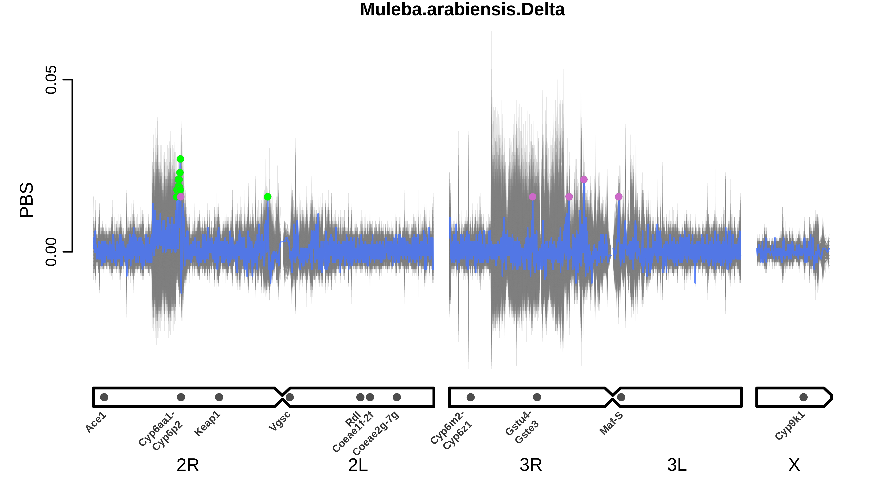
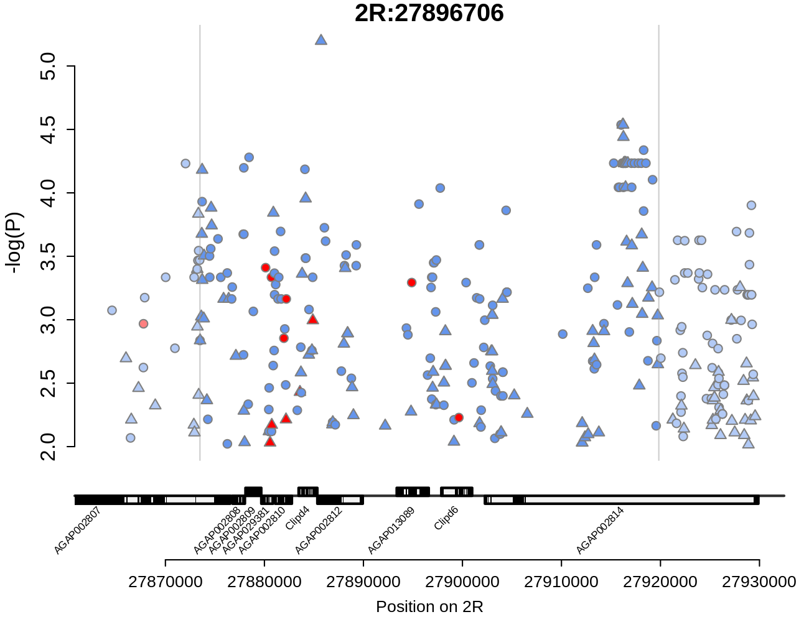
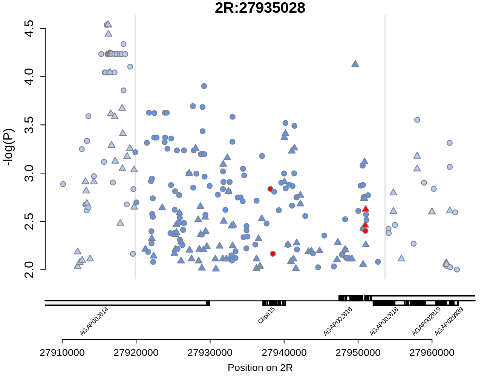
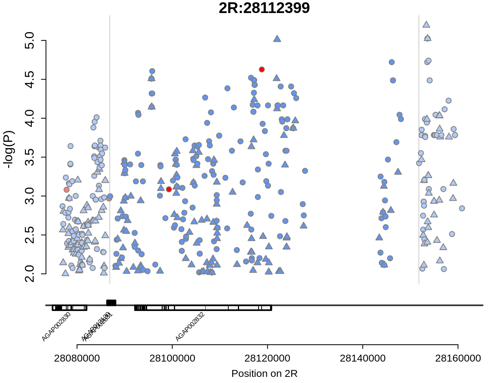
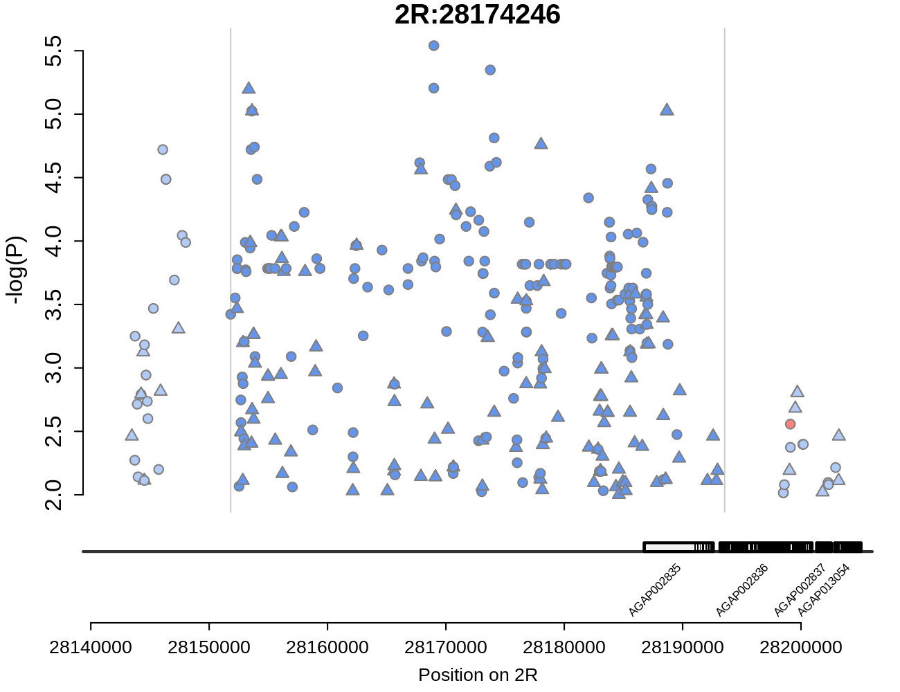
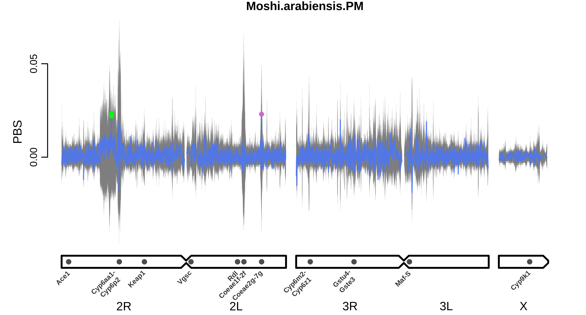

# PBS windows of interest

For each sample set, we first provide a summary plot of PBS across the genome, with PBS shown in blue and the results of the 200 randomisations shown behind in grey. Windows identified as peaks are highlighted by points, colour-coded by whether they are significantly higher than expected based on the simulations (green) or not (purple). For each significant window (green points), we then provide its own plot showing the significant (*P* < 0.01) SNPs found in the region of that window, and their -log10(Pvalue) of association with phenotype. Red points indicate non-synonymous SNPs, blue points indicate all other SNPs. Point shape indicates whether the mutant allele at that SNP is associated with increased (circle) or decreased (triangle) resistance. Dark points in the centre of the plot show SNPs within the significant window, light points on the sides show SNPs in the region 10,000 bp either side of the window. 

[Legend](#Plot_legend)  
[Moshi\_*arabiensis*\_Delta](#moshi_arabiensis_delta)  
[Muleba\_*arabiensis*\_Delta](#muleba_arabiensis_delta)  
[Moshi\_*arabiensis*\_PM](#moshi_arabiensis_pm)  

___

## Plot legend

<a id="Plot_legend">

___

## Moshi\_*arabiensis*\_Delta

&nbsp;

[Moshi_arabiensis_Delta_2L:3276066](#moshi_arabiensis_delta_2l_3276066)  
[Moshi_arabiensis_Delta_2R:28595065](#moshi_arabiensis_delta_2r_28595065)  
[Moshi_arabiensis_Delta_2R:28650798](#moshi_arabiensis_delta_2r_28650798)  
[Moshi_arabiensis_Delta_2R:28709379](#moshi_arabiensis_delta_2r_28709379)  
[Moshi_arabiensis_Delta_2R:28768446](#moshi_arabiensis_delta_2r_28768446)  
[Moshi_arabiensis_Delta_2R:28818887](#moshi_arabiensis_delta_2r_28818887)  
[Moshi_arabiensis_Delta_3L:33374272](#moshi_arabiensis_delta_3l_33374272)  

### Moshi_arabiensis_Delta_2L_3276066

&nbsp;

&nbsp;

### Moshi_arabiensis_Delta_2R_28595065

&nbsp;

&nbsp;

### Moshi_arabiensis_Delta_2R_28650798

&nbsp;

&nbsp;

### Moshi_arabiensis_Delta_2R_28709379

&nbsp;

&nbsp;

### Moshi_arabiensis_Delta_2R_28768446

&nbsp;

&nbsp;

### Moshi_arabiensis_Delta_2R_28818887

&nbsp;

&nbsp;

### Moshi_arabiensis_Delta_3L_33374272

&nbsp;

&nbsp;

___

## Muleba\_*arabiensis*\_Delta

&nbsp;

[Muleba_arabiensis_Delta_2R:27108686](#muleba_arabiensis_delta_2r_27108686)  
[Muleba_arabiensis_Delta_2R:27191090](#muleba_arabiensis_delta_2r_27191090)  
[Muleba_arabiensis_Delta_2R:27670025](#muleba_arabiensis_delta_2r_27670025)  
[Muleba_arabiensis_Delta_2R:27698574](#muleba_arabiensis_delta_2r_27698574)  
[Muleba_arabiensis_Delta_2R:27896706](#muleba_arabiensis_delta_2r_27896706)  
[Muleba_arabiensis_Delta_2R:27935028](#muleba_arabiensis_delta_2r_27935028)  
[Muleba_arabiensis_Delta_2R:28112399](#muleba_arabiensis_delta_2r_28112399)  
[Muleba_arabiensis_Delta_2R:28174246](#muleba_arabiensis_delta_2r_28174246)  
[Muleba_arabiensis_Delta_2R:28264928](#muleba_arabiensis_delta_2r_28264928)  
[Muleba_arabiensis_Delta_2R:28307853](#muleba_arabiensis_delta_2r_28307853)  
[Muleba_arabiensis_Delta_2R:56761889](#muleba_arabiensis_delta_2r_56761889)  

### Muleba_arabiensis_Delta_2R_27108686

&nbsp;

&nbsp;

### Muleba_arabiensis_Delta_2R_27191090

&nbsp;

&nbsp;

### Muleba_arabiensis_Delta_2R_27670025

&nbsp;

&nbsp;

### Muleba_arabiensis_Delta_2R_27698574

&nbsp;

&nbsp;

### Muleba_arabiensis_Delta_2R_27896706

&nbsp;

&nbsp;

### Muleba_arabiensis_Delta_2R_27935028

&nbsp;

&nbsp;

### Muleba_arabiensis_Delta_2R_28112399

&nbsp;

&nbsp;

### Muleba_arabiensis_Delta_2R_28174246

&nbsp;

&nbsp;

### Muleba_arabiensis_Delta_2R_28264928

&nbsp;

&nbsp;

### Muleba_arabiensis_Delta_2R_28307853

&nbsp;

&nbsp;

### Muleba_arabiensis_Delta_2R_56761889

&nbsp;

&nbsp;

___

## Moshi\_*arabiensis*\_PM

&nbsp;

___

